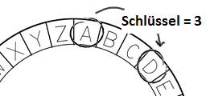

## Die Caesar-Verschlüsselung

Eine Verschlüsselung ist eine Art Geheimcode, bei dem man die Buchstaben miteinander vertauscht, damit niemand die Nachricht lesen kann.

Du wirst eine der ältesten und berühmtesten Verschlüsselungen benutzen, die **Caesar-Verschlüsselung**, die nach Julius Caesar benannt ist.

Ehe wir mit der Programmierung beginnen, wollen wir versuchen, die Caesar-Verschlüsselung zu benutzen, um ein Wort zu verstecken.

+ Das Verstecken eines Wortes wird **Verschlüsselung** (engl. encryption) genannt.
    
    Lass uns damit beginnen, den Buchstaben ‘a’ zu verschlüsseln. Damit wir dies tun können, müssen wir das Alphabet in einem Kreis zeichnen, z. B. so:
    
    

+ Damit du einen normalen Buchstaben in einen geheimen, verschlüsselten Buchstaben verwandeln kannst, brauchst du einen geheimen Schlüssel. Lass uns die Zahl 3 als Schlüssel benutzen (du kannst aber eine beliebige Zahl verwenden).
    
    Um den Buchstaben ‘a’ zu **verschlüsseln**, musst du 3 Buchstaben im Uhrzeigersinn weiter gehen und erhältst damit den Buchstaben ‘d’:
    
    

+ Du kannst das Gelernte jetzt dazu benutzen, um ein komplettes Wort zu verschlüsseln. ‘hallo’ wird zum Beispiel als ‘kdoor’ verschlüsselt. Probiere es selber.
    
    + h + 3 = **k**
    + a + 3 = **d**
    + l + 3 = **o**
    + l + 3 = **o**
    + o + 3 = **r**

+ Wenn man den Text wieder in den ursprünglichen Zustand verwandelt, nennt man das **Entschlüsselung** (engl. decryption). Um ein Wort zu entschlüsseln, musst du einfach nur den Schlüssel subtrahieren, anstatt ihn zu addieren:
    
    + k - 3 = **h**
    + d - 3 = **a**
    + o - 3 = **l**
    + o - 3 = **l**
    + r - 3 = **o**