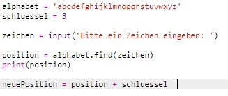

## Buchstaben verschlüsseln

Lass uns ein Python Programm schreiben, um ein einzelnes Zeichen zu verschlüsseln.

+ Öffne ein leeres Python-Trinket: <a href="http://jumpto.cc/python-new" target="_blank">jumpto.cc/python-new</a>.

+ Anstatt das Alphabet in einem Kreis aufzuzeichnen, lass uns dafür die Variable `alphabet` verwenden.
    
    

+ Jeder Buchstabe des Alphabets hat eine Position, und wir beginnen mit der Position 0. Das heißt also, dass sich der Buchstabe ‘a’ an der Position 0 des Alphabets befindet und der Buchstabe ‘c’ auf Position 2 ist.
    
    

+ Du kannst einen Buchstaben aus deiner Variablen `alphabet` erhalten, indem du die Positionsnummer in eckige Klammern schreibst.
    
    
    
    Du kannst die `print`-Befehle löschen, wenn du alles ausprobiert hast.

+ Dann musst du den geheimen Schlüssel in der Variablen `schluessel` speichern.
    
    

+ Frage dann den Benutzer nach einem einzelnen Buchstaben (einem `Zeichen`) um ihn zu verschlüsseln.
    
    

+ Finde die `Position` von diesem `Zeichen`.
    
    

+ Du kannst die gespeicherte Position `(position)` testen, indem du sie ausdruckst. Zum Beispiel, ob sich der Buchstabe ‘e’ in der Position Nummer 4 der Variablen alphabet befindet.
    
    

+ Um ein `zeichen` zu verschlüsseln, musst du den Schlüssel `schluessel` zu der Position `position` addieren. Das Ergebnis wird in der Variablen `neuePosition` gespeichert.
    
    

+ Füge nun den Programmcode hinzu, um die neue Position des Zeichens anzuzeigen.
    
    

+ Teste deinen neuen Code. Da unser `schluessel` = 3 ist, sollte er die Zahl 3 zu der Position `position` addieren und das Ergebnis in der Variablen `neuePosition` speichern.
    
    Zum Beispiel befindet sich der Buchstabe ‘e’ auf Position Nummer 4. Um ihn zu verschlüsseln, addierst du den `schluessel` (3), was insgesamt 7 ergibt.
    
    

+ Was passiert, wenn du versuchst, den Buchstaben ‘y’ zu verschlüsseln?
    
    
    
    Wie du siehst, ist der Wert von `neuePosition` jetzt 27, aber es gibt keine 27 Buchstaben in alphabet!

+ Du kannst den Modulo-Operator `%` benutzen, um der neuen Position mitzuteilen, wieder auf die Position Nummer 0 zurückzugehen, nachdem sie die Position Nummer 26 erreicht hat.
    
    

+ Und zum Schluss wollen wir den Buchstaben an der neuen Position anzeigen.
    
    Wenn du zum Beispiel den Schlüssel zur Position des Buchstabens ‘e’ addierst, erhältst du 7, und der Buchstabe an der Position Nummer 7 von alphabet ist das ‘h’.
    
    

+ Probiere deinen neuen Code aus. Du kannst auch manche deiner print-Befehle entfernen und einfach nur zum Schluss das neue Zeichen anzeigen.
    
    