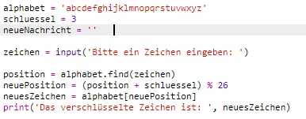
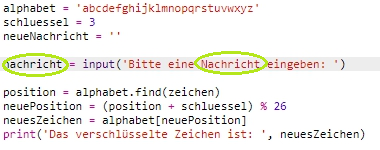
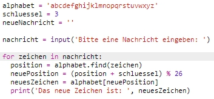

## Komplette Nachrichten verschlüsseln

Anstatt die Nachricht Buchstabe für Buchstabe zu verschlüsseln bzw. zu entschlüsseln, lass uns jetzt das Programm so ändern, dass komplette Nachrichten verschlüsselt werden!

+ Prüfe erst, ob dein Code so aussieht:
    
    

+ Definiere eine Variable um die neue, verschlüsselte Nachricht zu speichern.
    
    

+ Ändere deinen Code, damit du die ganze Nachricht des Benutzers und nicht nur einen einzelnen Buchstaben speichern kannst.
    
    

+ Füge deinem Code eine `for`-Schleife hinzu und rücke den Rest des Codes ein, damit er für jeden Buchstaben in der Nachricht wiederholt wird.
    
    

+ Teste deinen Code. Du solltest sehen, dass jedes Zeichen aus der Nachricht verschlüsselt und nacheinander angezeigt wird.
    
    

+ Lass uns nun jedes verschlüsselte Zeichen zu deiner Variablen `neueNachricht` hinzufügen.
    
    

+ Du kannst die `neueNachricht` auch `anzeigen` während sie verschlüsselt wird.
    
    

+ Wenn du die Leerzeichen vor dem `print`-Befehl löschst, wird die verschlüsselte Nachricht nur einmal zum Schluss angezeigt. Du kannst auch den Code zum Anzeigen der Positionsnummern der Buchstaben löschen.
    
    