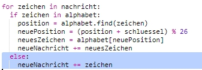

## Zusätzliche Zeichen

Manche Zeichen sind nicht im Alphabet enthalten, was einen Fehler verursacht.

+ Teste deinen Code mit ein paar Zeichen, die nicht im Alphabet sind.
    
    Du könntest zum Beispiel die Nachricht `Hallo Leute!!` benutzen.
    
    
    
    Wie du siehst, wurden das Leerzeichen und die `!`-Zeichen alle als Buchstabe 'c' verschlüsselt!

+ Um dieses Problem zu beheben, solltest du ein Zeichen nur verschlüsseln, wenn es im Alphabet enthalten ist. Um dies zu tun, füge deinem Code einen `if`-Befehl hinzu und rücke den Rest deines Codes ein.
    
    

+ Teste deinen Code mit der gleichen Nachricht. Was passiert diesmal?
    
    
    
    Jetzt überspringt dein Code jedes Zeichen, das nicht im Alphabet enthalten ist.

+ Es wäre besser, wenn dein Code alles, was nicht im Alphabet steht, nicht einfach überspringen, sondern statt dessen das ursprüngliche Zeichen benutzen würde.
    
    Füge deinem Code einen `else`-Befehl hinzu, der das ursprüngliche Zeichen zur verschlüsselten Nachricht hinzufügt.
    
    

+ Teste deinen Code. Du wirst sehen, dass nun jedes Zeichen im Alphabet verschlüsselt wird, dass aber alle anderen Zeichen im Originalzustand bleiben!
    
    