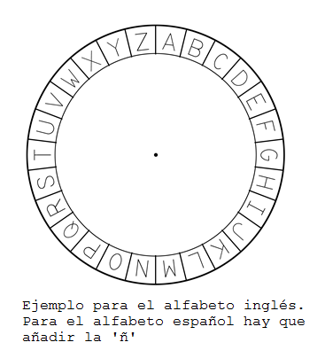
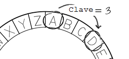

## El cifrado César

Un cifrado es un tipo de código secreto, donde intercambias las letras para que nadie pueda leer tu mensaje.

Utilizarás uno de los cifrados más antiguos y famosos, el **cifrado César**, que lleva el nombre de Julio César.

Antes de empezar a escribir código, intentemos usar el cifrado César para ocultar una palabra.

+ Ocultar una palabra también se llama **encriptar**.
    
    Empecemos encriptando la letra 'a'. Para hacerlo, podemos escribir el alfabeto en un círculo como este:
    
    

+ Para definir una letra secreta encriptada a partir de una normal, necesitas tener una clave secreta. Usaremos el número 3 como clave (pero puedes usar cualquier otro número).
    
    Para **encriptar** la letra 'a', solo tienes que moverte 3 letras en el sentido de las agujas del reloj, lo que te dará la letra 'd':
    
    

+ Puedes usar lo aprendido para encriptar una palabra completa. Por ejemplo, 'hola' encriptada es 'krod'. Pruébalo tú mismo.
    
    + h + 3 = **k**
    + o + 3 = **r**
    + l + 3 = **o**
    + a + 3 = **d**
    + 

+ Hacer que el texto vuelva a la normalidad se llama **desencriptar**. Para desencriptar una palabra, simplemente hay que restar la clave en lugar de sumarla:
    
    + k - 3 = **h**
    + r - 3 = **o**
    + o - 3 = **l**
    + d - 3 = **a**
    +