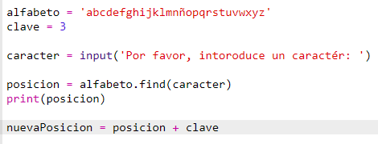

## Letras encriptadas

Escribamos un programa Python para encriptar un caracter simple.

+ Abre la plantilla Python en blanco en Trinket: <a href="http://jumpto.cc/python-new" target="_blank">jumpto.cc/python-new</a>.

+ En vez de dibujar el alfabeto en un círculo, vamos a representarlo como una variable llamada `alfabeto`.
    
    

+ Cada letra del alfabeto tiene una posición, empezando por la posición 0. Como vemos en la imagen, la letra 'a' está en la posición 0 del alfabeto y la 'c' está en la posición 2.
    
    

+ Puedes obtener una letra de la variable `alfabeto` escribiendo su posición entre corchetes.
    
    
    
    Una vez que hayas comprobado esto, puedes borrar las sentencias `print`.

+ Luego, tienes que guardar la `clave` secreta en una variable.
    
    

+ Ahora pide al usuario por una sola letra (llamada `caracter`) para encriptarla.
    
    

+ Encuentra la `posicion` del `caracter`.
    
    

+ Puedes comprobar la `posicion` guardada si la imprimes. Por ejemplo, que el carácter 'e' está en la posición 4 del alfabeto.
    
    

+ Para encriptar el `caracter`, tienes que sumar la `clave` a su `posicion`. La suma se almacena en la variable `nuevaPosicion`.
    
    

+ Añade código para imprimir la nueva posición del carácter.
    
    

+ Prueba tu nuevo código. Como tu `clave` es 3, tienes que sumar 3 a la `posición` y guardar el resultado en la variable `nuevaPosicion`.
    
    Por ejemplo, la letra 'e' está en la posición 4. Para encriptarla tienes que sumarle la `clave` (3), lo que da 7.
    
    

+ ¿Que pasa si tratas de encriptar la letra 'y'?
    
    
    
    ¡Fíjate que la `nuevaPosicion` es 28, y que no hay 28 letras en el alfabeto!

+ Puedes usar la función `%` para indicar que la nueva posición debe volver a la posición 0 si llega a la posición 27.
    
    

+ Para acabar, quieres imprimir la letra de la nueva posición.
    
    Por ejemplo, sumando la clave a la letra 'e' da 7, y la letra en la posición 7 del alfabeto es 'h'.
    
    

+ Comprueba tu código. También puedes borrar algunas sentencias print y dejar solo la que imprime el nuevo carácter al final.
    
    