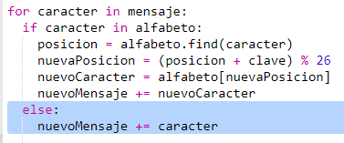

## Caracteres adicionales

Algunos caracteres no están en el alfabeto, lo que causa un error.

+ Comprueba tu código con algunos caracteres que no están en el alfabeto.
    
    Por ejemplo, puedes usar el mensaje `¡¡hola a todos!!`.
    
    
    
    Fíjate que el espacio y los caracteres `¡!` se encriptan como una letra 'c'!

+ Para solucionar esto, solo debes convertir un carácter si es que está en el alfabeto. Para hacer esto, añade una sentencia `if` (si...) e indenta el resto de tu código.
    
    

+ Prueba tu código con el mismo mensaje. ¿Qué sucede ahora?
    
    
    
    Ahora tu código simplemente omite cualquier carácter que no está en el alfabeto.

+ Mejor sería que tu código no solo no encriptara cualquier cosa que no esté en el alfabeto, sino que use el carácter no alfabetico.
    
    Añade una sentencia `else` (si no...) a tu código para que simplemente añada el carácter no alfabetico al mensaje encriptado.
    
    

+ Prueba tu código. ¡Ahora deberías ver que cada carácter en el alfabeto es encriptado pero que cualquier otro carácter no alfabetico se quede tal como está!
    
    