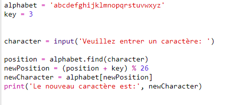
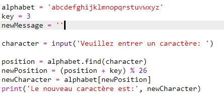
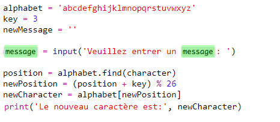
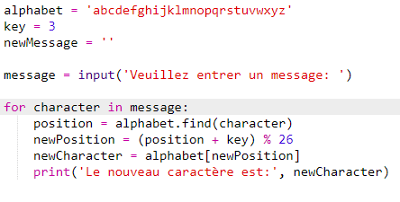
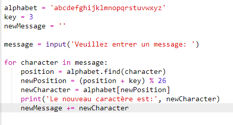

## Crypter des messages entiers

Au lieu de simplement crypter et décrypter les messages, un caractère à la fois, changeons le programme pour chiffrer des messages entiers!

+ Tout d'abord, vérifie que ton code ressemble à ceci:
    
    

+ Crée une variable pour stocker le nouveau message crypté.
    
    

+ Modifie ton code pour stocker le message de l'utilisateur et non pas un seul caractère.
    
    

+ Ajoute une boucle `for` à ton code et indente le reste du code afin qu'il soit répété pour chaque caractère du message.
    
    

+ Teste ton code. Tu devrais voir que chaque caractère du message est crypté et imprimé un seul à la fois.
    
    

+ Ajoutons chaque caractère crypté à ta variable `newMessage`.
    
    

+ Tu peux `afficher` le `newMessage` car il est crypté.
    
    

+ Si tu supprimes les espaces avant la déclaration `print`, le message crypté ne sera affiché qu’une fois à la fin. Tu peux également supprimer le code pour imprimer les positions des caractères.
    
    