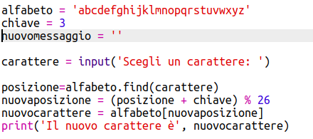
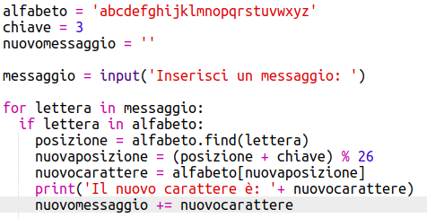

## Criptare interi messaggi

Invece di criptare e decriptare i messaggi un solo carattere alla volta, modifichiamo il programma per criptare interi messaggi!

+ Innanzitutto, controlla che il tuo codice assomigli a questo:
    
    

+ Crea una variabile per memorizzare il nuovo messaggio criptato.
    
    

+ Cambia il tuo codice per memorizzare un intero messaggio dell'utente e non un solo carattere.
    
    

+ Aggiungi un ciclo `for` al tuo codice e indenta il resto del codice in modo che venga ripetuto per ogni lettera del messaggio.
    
    

+ Prova il tuo codice. Dovresti vedere che ogni carattere nel messaggio è criptato e mostrato uno alla volta.
    
    

+ Aggiungiamo ogni carattere criptato alla tua variabile `nuovomessaggio`.
    
    

+ Puoi stampare con `print` il `nuovomessaggio` criptato.
    
    

+ Se elimini gli spazi prima del comando `print`, il messaggio criptato verrà visualizzato solo una volta alla fine. Puoi anche cancellare il codice che mostra le posizioni dei caratteri.
    
    