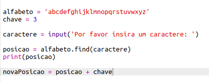
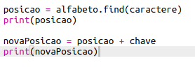

## Criptografando cartas

Vamos escrever um programa em Python para criptografar um único caractere.

+ Abra o modelo Trinket em branco do Python: <a href="http://jumpto.cc/python-new" target="_blank">jumpto.cc/python-new</a>.

+ Em vez de desenhar o alfabeto em um círculo, vamos escrevê-lo como uma variável `alfabeto`.
    
    

+ Cada letra do alfabeto tem uma posição, começando na posição 0. Portanto, a letra 'a' está na posição 0 do alfabeto e 'c' está na posição 2.
    
    

+ Você pode obter uma letra da sua variável `alfabeto` escrevendo a posição entre colchetes.
    
    
    
    Você pode excluir as declarações de `print` depois de tentar isso.

+ Em seguida, você precisará armazenar a `chave` secreta em uma variável.
    
    

+ Em seguida, peça ao usuário uma única letra (chamada de `caractere`) para criptografar.
    
    

+ Encontre a `posição` do `caractere`.
    
    

+ Você pode testar a `posição` armazenada imprimindo-a. Por exemplo, o caractere 'e' está na posição 4 do alfabeto.
    
    

+ Para criptografar o `caractere`, você deve adicionar a `chave` à `posição`. Isso é então armazenado na variável `novaPosicao`.
    
    

+ Adicione código para imprimir a nova posição do caractere.
    
    

+ Teste seu novo código. Como sua `chave` é 3, ela deve adicionar 3 à variável `posicao` e armazená-la na variável `novaPosicao`.
    
    Por exemplo, a letra 'e' está na posição 4. Para criptografar, você adiciona a `chave` (3), dando 7.
    
    

+ O que acontece quando você tenta criptografar a letra 'y'?
    
    
    
    Observe como `novaPosicao` é 27 e não há 27 letras no alfabeto!

+ Você pode usar um `%` para dizer à nova posição para voltar à posição 0 quando chegar à posição 26.
    
    

+ Finalmente, você deseja mostrar a letra na nova posição.
    
    Por exemplo, adicionar a chave à letra 'e' dá 7 e a letra na posição 7 do alfabeto é 'h'.
    
    

+ Experimente o seu código. Você também pode remover algumas das suas instruções de print, apenas imprimindo o novo caractere no final.
    
    