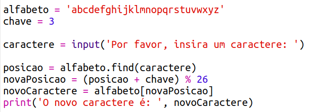
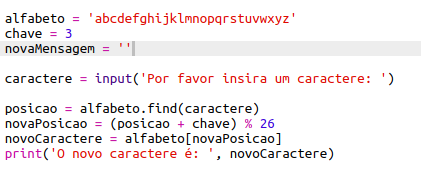
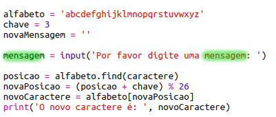
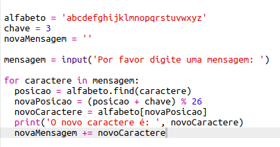

## Criptografando mensagens inteiras

Em vez de apenas criptografar e descriptografar mensagens um caractere de cada vez, vamos mudar o programa para criptografar mensagens inteiras!

+ Em primeiro lugar, verifique se o seu código está assim:
    
    

+ Crie uma variável para armazenar a nova mensagem criptografada.
    
    

+ Altere seu código para armazenar a mensagem do usuário e não apenas um caractere.
    
    

+ Adicione um laço `for` ao seu código e recue o restante do código para que ele seja repetido para cada caractere na mensagem.
    
    

+ Teste seu código. Você deve ver que cada caractere na mensagem é criptografado e impresso um de cada vez.
    
    

+ Vamos adicionar cada caractere criptografado à sua variável `novaMensagem`.
    
    

+ Você pode imprimir a `novaMensagem` com o comando `print` quando ela for criptografada.
    
    

+ Se você excluir os espaços antes da instrução `print`, a mensagem criptografada será exibida apenas uma vez no final. Você também pode excluir o código para imprimir as posições dos caracteres.
    
    