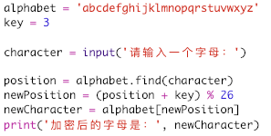
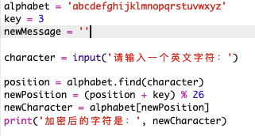
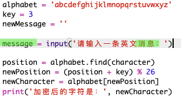
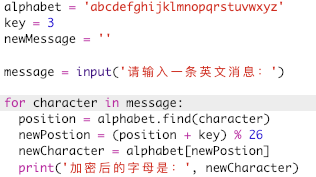
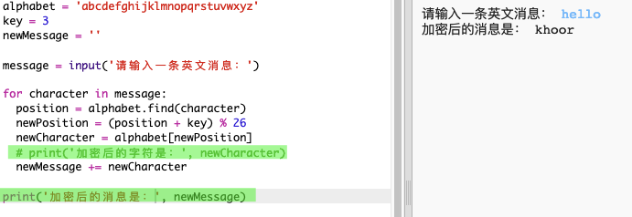

## 加密整条消息

让我们更改程序以加密整个消息, 而不是一次只对一个字符进行加密和解密!

+ 首先，确认你的代码是这样的：
    
    

+ 创建一个变量来存储加密后的消息。
    
    

+ 更改你的代码来存储用户的整条消息，而不仅仅是一个字母。
    
    

+ 在你的代码中添加一个`for`循环，然后缩进余下的代码使之循环地对消息中的每一个字母进行加密操作。
    
    

+ 测试您的代码。您应该看到消息中的每个字符都经过加密了并一次只输出一个字符。
    
    

+ 让我们将每个加密的字符添加到 `newMessage` 变量中。
    
    

+ 你可以一边进行加密一边`print`（输出）`newMessage`变量的值。
    
    

+ 如果你删除`print`语句前的空格（使其不要缩进），那么加密好的消息只会在循环结束后再显示，你还可以删除输出字符位置的代码。
    
    