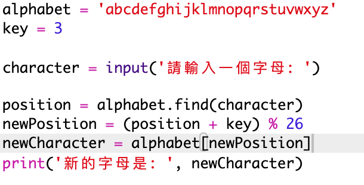
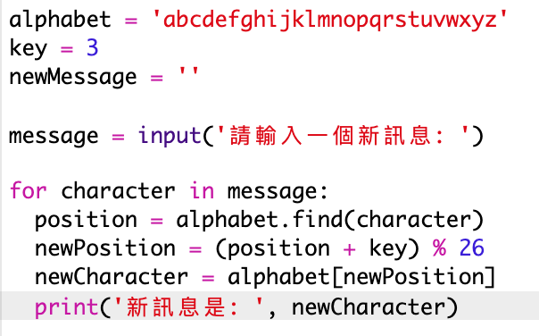
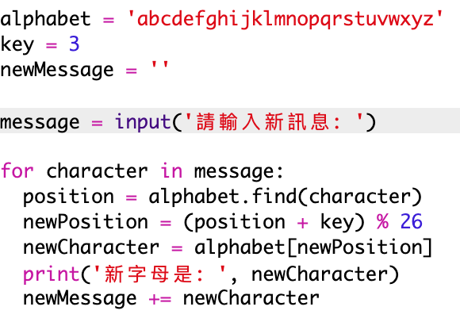
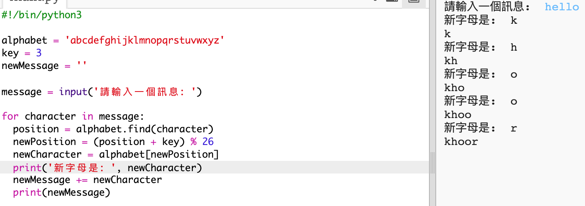
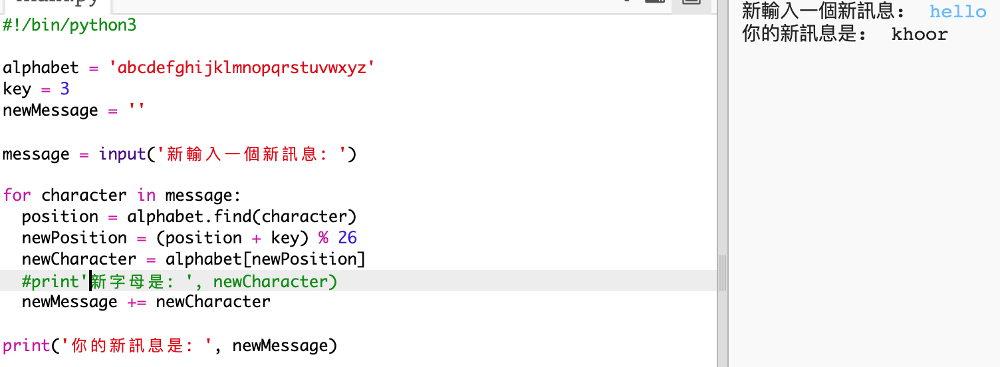

## 對完整資訊進行加密

讓我們修改程式來加密完整的資訊，而非一次僅加密和解密一個字元！

+ 首先，請檢查你的程式碼是否如下所示：
    
    

+ 建立一個變數來儲存新加密的資訊。
    
    

+ 更改你的程式碼來儲存使用者的資訊，而不僅僅是一個字元。
    
    

+ 向你的程式碼新增 `for` 迴圈，並縮排剩餘的程式碼，使其對資訊中的每個字元重複執行。
    
    

+ 測試你的程式碼。你會看到資訊中的每個字元一個接一個地被加密並列印出來。
    
    

+ 讓我們向你的 `newMessage` 變數新增每個被加密的字元。
    
    

+ 你可以在它被加密時，將`newMessage`變數`print`（列印）出來 。
    
    

+ 如果你刪掉 `print`（列印）語句之前的空格，被加密的資訊僅會在末尾顯示一次。你還可以刪除列印字元位置的程式碼。
    
    